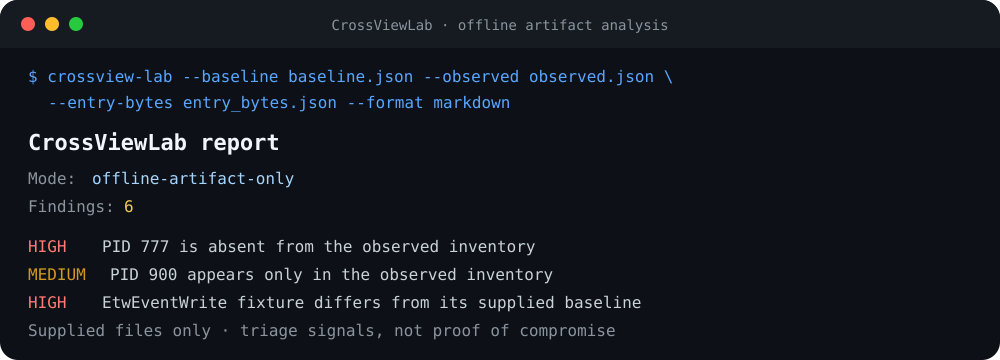
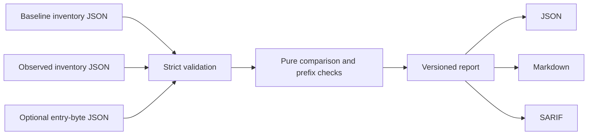

<div align="center">

# CrossViewLab

**Catch cross-view gaps before they become blind spots.**

Offline, zero-runtime-dependency analysis for exported process inventories and
function-entry byte fixtures—with JSON, Markdown, and GitHub SARIF output.

[](https://github.com/bsmensah-ctrl/CrossViewLab/actions/workflows/ci.yml)
[](https://www.python.org/)
[](LICENSE)
[](#safety-boundary)

</div>



CrossViewLab gives detection engineers, incident-response students, and lab
authors a small reproducible way to test two useful ideas:

1. **Cross-view comparison:** does one exported process inventory omit or alter
   a record found in another?
2. **Entry-byte triage:** do supplied function-entry bytes differ from a supplied
   baseline or begin with a common jump/return indicator?

It analyzes files you provide. It does **not** enumerate the host, open a
process, read memory, load a driver, hook an API, or modify the operating system.

## 60-second demo

```bash
git clone https://github.com/bsmensah-ctrl/CrossViewLab.git
cd CrossViewLab
python -m pip install -e .

crossview-lab \
  --baseline fixtures/inventory_baseline.json \
  --observed fixtures/inventory_observed.json \
  --entry-bytes fixtures/entry_bytes.json \
  --format markdown
```

Windows PowerShell:

```powershell
crossview-lab `
  --baseline fixtures/inventory_baseline.json `
  --observed fixtures/inventory_observed.json `
  --entry-bytes fixtures/entry_bytes.json `
  --format markdown
```

No install is required for a source checkout:

```bash
PYTHONPATH=src python -m crossview_lab --baseline fixtures/inventory_baseline.json --observed fixtures/inventory_observed.json
```

## What it detects

| Signal | Example interpretation | Severity |
|---|---|---|
| Baseline PID absent from observed export | A record may have been filtered, collection may have raced, or permissions may differ | High |
| PID appears only in observed export | A new process, stale baseline, or collection race | Medium |
| Shared PID has inconsistent fields | PID reuse, collection drift, or altered metadata | Medium |
| Observed entry bytes differ from supplied baseline | Version mismatch, patching, or instrumentation | High |
| Entry begins with `RET`, `XOR EAX,EAX; RET`, or a jump | A triage-worthy stub or trampoline | Medium–High |

These are **triage signals, not proof of compromise**. Cross-view results can
also be caused by timing, access level, PID reuse, software version differences,
or inconsistent exporters.

## Outputs built for real workflows

```bash
# Machine-readable report
crossview-lab ... --format json --output report.json

# Human review
crossview-lab ... --format markdown --output report.md

# GitHub code scanning / SARIF viewers
crossview-lab ... --format sarif --output crossview.sarif

# Make findings fail a CI job
crossview-lab ... --fail-on-findings
```

The JSON report contract is versioned in
[`schemas/report.schema.json`](schemas/report.schema.json). SARIF uses synthetic
artifact URIs and embeds the exact supplied evidence in result properties.

## Input format

Inventory exports need a source label and unique non-negative PIDs:

```json
{
  "source": "trusted-export",
  "processes": [
    {
      "pid": 420,
      "ppid": 100,
      "name": "example-service.exe",
      "path": "synthetic://program-files/example-service.exe",
      "user": "LAB\\analyst",
      "command_line": "example-service.exe --service"
    }
  ]
}
```

Entry-byte artifacts can provide an observed value alone or pair it with a
baseline:

```json
{
  "source": "offline-memory-export",
  "samples": [
    {
      "component": "ntdll",
      "symbol": "ExampleSymbol",
      "baseline_hex": "4c8bd1b8260000000f05c3",
      "observed_hex": "4c8bd1b8260000000f05c3"
    }
  ]
}
```

See [the fixture guide](docs/FIXTURES.md) for validation rules and clean-case
design.

## How it works



The core is intentionally boring: deterministic parsing, set comparison, field
comparison, and entry-prefix checks. There is no agent, model, network client,
or platform-specific runtime dependency in the package.

## Safety boundary

CrossViewLab is an artifact analyzer, not a live endpoint scanner. Its package
contains no `ctypes`, `psutil`, `socket`, `subprocess`, or `winreg` imports and no
Windows process-memory API calls. A regression test enforces that boundary.

This design makes the project safe to use in classrooms, CI, fixture-driven
detection exercises, and report reproduction. It also means CrossViewLab cannot
tell you what is currently running on a machine; acquisition belongs to a
separate, explicitly authorized workflow.

## Development

```bash
python -m pip install -e ".[dev]"
pytest
ruff check .
ruff format --check .
```

The test suite covers malformed inputs, clean cases, inventory discrepancies,
byte-prefix logic, report schema validation, all three output formats, CLI exit
codes, and the offline-only boundary.

## Roadmap

- [ ] Pluggable normalization profiles for common inventory exporters
- [ ] Timeline-aware comparison to reduce collection-race false positives
- [ ] HTML report renderer with evidence filtering
- [ ] Additional fixture packs contributed by the community
- [ ] Signed report manifests for classroom and CI provenance

Contributions are welcome. Start with [CONTRIBUTING.md](CONTRIBUTING.md) and keep
new features inside the offline-artifact boundary.

## Origin and evidence quality

CrossViewLab was built from a local-LLM security-lab experiment whose generated
code was not runnable and whose later output crossed its stated offline boundary.
The implementation in this repository was rewritten, tested, and scoped around
the reusable defensive idea rather than publishing those unverified outputs.
No claim in this repository depends on the model-generated transcript.

The [local-LLM output audit](docs/LLM_OUTPUT_AUDIT.md) records the failed outputs,
the parts that survived review, and a reusable ten-point checklist for evaluating
generated security code.

## License

MIT — see [LICENSE](LICENSE).
