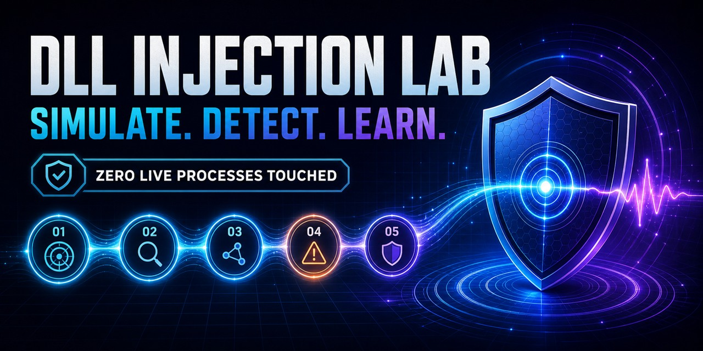
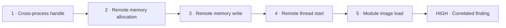

<p align="center">
  
</p>

<div align="center">

# DLL Injection Lab

### See the full DLL-injection telemetry chain—without injecting a DLL.

**Simulate it. Detect it. Break the sequence. Prove your rule works.**

No VM. No administrator rights. No malware. Zero live processes touched.

[](https://github.com/bsmensah-ctrl/DLL-Injection-Lab/actions/workflows/ci.yml)
[](tests)
[](https://www.python.org/)
[](pyproject.toml)
[](https://attack.mitre.org/techniques/T1055/001/)
[](LICENSE)

**If this saves you an afternoon of lab setup, star the repository so another defender finds it.**

</div>

> **No install?** [Run the interactive browser demo](https://bsmensah-ctrl.github.io/DLL-Injection-Lab/)
> and remove events from the chain to watch the finding disappear.

## Your first detection in 60 seconds

```bash
git clone https://github.com/bsmensah-ctrl/DLL-Injection-Lab.git
cd DLL-Injection-Lab
python -m pip install -e .
dll-injection-lab demo
```

```text
# DLL Injection Lab report

- Mode: synthetic-event-only
- Findings: 1

| Severity | Finding | Evidence |
|---|---|---|
| HIGH | Synthetic DLL-injection sequence detected | classic-dll-injection-001 |
```

That result came from a deterministic five-event chain generated entirely in
memory. Nothing was injected, opened, downloaded, hidden, or executed.

## Why this exists

Most DLL-injection labs force you to choose between two bad options:

- Run offensive proof-of-concept code in a Windows VM just to produce telemetry.
- Read a slide deck and never test whether a detection rule actually correlates.

DLL Injection Lab gives you the useful middle: **the observable event chain,
clean controls, correlation logic, and portable reports—without the dangerous
mechanism.** It is an ethical hacking lab built for defenders, students, SOC
analysts, instructors, and detection engineers.

## What you get

| Capability | Why it matters |
|---|---|
| Full synthetic injection chain | Practice correlating five signals instead of matching one noisy event |
| Clean cooperative control | Prove the detector ignores an approved same-process plug-in load |
| Explainable finding | See the exact matched actions, flow ID, PIDs, ticks, module, and ATT&CK mapping |
| JSONL event generator | Feed deterministic telemetry into your own parser, SIEM demo, or unit test |
| JSON, Markdown, and SARIF | Use the same result in scripts, reports, GitHub, or classroom submissions |
| Offline boundary test | CI fails if live-process libraries or Windows process-memory APIs enter the package |
| Zero runtime dependencies | Clone, install, and run—no service stack or agent required |

## The chain your detector must catch

The built-in `classic` scenario emits these synthetic observations in order:



The detector requires the complete ordered sequence within one correlation flow
and rejects same-process activity. Read the [detection guide](docs/DETECTION_GUIDE.md)
for signal meaning, benign explanations, and ATT&CK context.

## Try the lab

### 1. Catch the classic sequence

```bash
dll-injection-lab demo
```

Expected: **1 high-severity finding** across 5 synthetic events.

### 2. Run the clean control

```bash
dll-injection-lab demo --scenario cooperative
```

Expected: **0 findings**. The fictional host and target are the same process and
the plug-in load follows explicit synthetic user approval.

### 3. Inspect the raw telemetry

```bash
dll-injection-lab simulate --scenario classic --output events.jsonl
dll-injection-lab detect --events events.jsonl --format json
```

Delete one event from the JSONL stream and rerun detection. The finding disappears,
making the correlation requirement visible and easy to test.

### 4. Turn it into a CI gate

```bash
dll-injection-lab detect \
  --events events.jsonl \
  --format sarif \
  --output dll-injection.sarif \
  --fail-on-findings
```

The CLI exits `1` when findings exist only if `--fail-on-findings` is supplied.
Default runs remain exploration-friendly.

## What a finding contains

```json
{
  "type": "synthetic-dll-injection-sequence",
  "severity": "high",
  "evidence": {
    "flow_id": "classic-dll-injection-001",
    "actor_pid": 4100,
    "target_pid": 4200,
    "module": "synthetic://lab/telemetry-demo.dll",
    "matched_actions": [
      "cross_process_handle_open",
      "remote_memory_allocation",
      "remote_memory_write",
      "remote_thread_start",
      "image_load"
    ],
    "attack_technique": "T1055.001",
    "synthetic": true
  }
}
```

Every identifier and URI above is fictional and deterministic.

## More than one lab

The original CrossView engine remains available as a secondary artifact-analysis
mode. It compares supplied process-inventory exports and inspects supplied
function-entry bytes without collecting anything from the host:

```bash
dll-injection-lab artifacts \
  --baseline fixtures/inventory_baseline.json \
  --observed fixtures/inventory_observed.json \
  --entry-bytes fixtures/entry_bytes.json \
  --format markdown
```

## Safety promise

This project simulates **telemetry**, not injection. The package contains no
`ctypes`, `psutil`, `socket`, `subprocess`, or `winreg` imports and no Windows
process-memory API calls. It never enumerates the host, opens a process, allocates
remote memory, writes to another process, starts a thread, loads a DLL, or requests
administrator privileges.

A dedicated regression test scans the package and fails if prohibited imports or
API tokens appear. The `synthetic=true` declaration is mandatory on every imported
event.

## Built for

- **Detection engineers** testing multi-event correlation logic.
- **SOC analysts** learning what an injection sequence looks like in telemetry.
- **Cybersecurity students** who need a repeatable ethical DLL-injection lab.
- **Instructors** who want clean and suspicious controls with expected results.
- **Tool builders** who need small JSONL fixtures and SARIF examples.

## Verify it yourself

```bash
python -m pip install -e ".[dev]"
pytest
ruff check .
ruff format --check .
```

The 35-test suite covers the simulator, ordered correlation, incomplete chains,
same-process clean controls, malformed JSONL, artifact comparison, byte-prefix
triage, schema validation, output formats, CLI composition, and the offline boundary.
GitHub Actions runs the suite on Python 3.10, 3.11, 3.12, and 3.13.

## Roadmap

- [ ] Additional safe scenarios: section mapping, thread hijack telemetry, and APC-style event chains
- [ ] Sigma and KQL rule examples driven by the same synthetic fixtures
- [ ] Timeline visualization and interactive event removal
- [ ] Import adapters for sanitized Sysmon and EDR exports
- [ ] Instructor packs with challenge and answer fixtures
- [ ] Signed scenario manifests for reproducible classroom exercises

Have an idea? Open a [feature request](https://github.com/bsmensah-ctrl/DLL-Injection-Lab/issues/new/choose)
or send a pull request. New scenarios must remain synthetic and deterministic.

## Contributing

If you learned something, used a fixture, or saved setup time:

1. **Star the repository** so other detection engineers can find it.
2. Add a synthetic scenario or clean control.
3. Share the 60-second demo with a SOC, blue-team, or cybersecurity class.
4. Report false positives or confusing evidence.

## License

MIT — use it, teach with it, and improve it. See [LICENSE](LICENSE).
